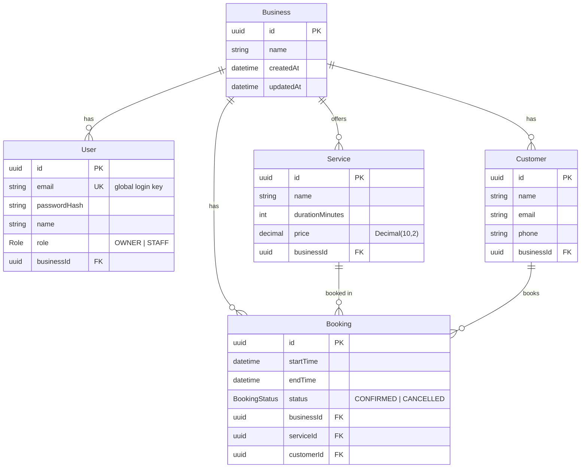

# KiwiSlot — a multi-tenant booking API for small businesses (NestJS · PostgreSQL · Prisma · Docker)

KiwiSlot is a booking/reservation backend for small businesses such as cafés and salons.
It is **multi-tenant**: many independent businesses share one deployment, each with its
data fully isolated from the others. The project is built to demonstrate ownership of a
real backend — authentication, relational modeling, role-based authorization, a
non-trivial business rule under concurrency (double-booking prevention), testing, and
containerized deployment.

> Status: 🚧 In active development. See the roadmap below.

## Architecture overview
_TBD — module structure (Auth, Business, Service, Customer, Booking), guards, and the
Prisma data layer will be documented here._

## Data model (ER diagram)

KiwiSlot is multi-tenant: every tenant-owned row carries a `businessId`, so isolation is a
simple `where: { businessId }` on every query. A `Booking` also stores `businessId`
directly (denormalized) so tenant filtering never needs a join.

## Tech stack
- **NestJS** (TypeScript) — modular backend (modules / controllers / services / DI)
- **PostgreSQL** + **Prisma** ORM
- **JWT** access tokens + **bcrypt** password hashing
- **class-validator / class-transformer** for DTO validation
- **Jest** for unit + e2e tests
- **Docker** — production multi-stage `Dockerfile`; `docker-compose` for local Postgres
- **GitHub Actions** for CI (lint + test)
- **Deploy:** Neon (Postgres) + Render (web service). The container also runs unchanged on
  AWS ECS / GCP Cloud Run.

## Roadmap
- [ ] Phase 0 — Setup (Docker, local Postgres, NestJS scaffold)
- [x] Phase 1 — Data model (Prisma schema + migration + ERD)
- [x] Phase 2 — Auth (register, login, JWT, bcrypt)
- [ ] Phase 3 — Authorization & multi-tenancy
- [ ] Phase 4 — Services (CRUD)
- [ ] Phase 5 — Customers (create / list)
- [ ] Phase 6 — Bookings (double-booking prevention)
- [ ] Phase 7 — Tests
- [ ] Phase 8 — Containerize & CI
- [ ] Phase 9 — Deploy (Neon + Render)

## Running locally
_TBD — documented in Phase 0 (Docker Compose Postgres + `npm run start:dev`)._

## Key decisions & what I learned

- **ORM = Prisma (v6).** Type-safe schema-first ORM with managed migrations. Pinned to v6
  because v7 mandates driver adapters + `prisma.config.ts`; v6's single `url` datasource is
  simpler and far better documented for a learning project. See `docs/adr/0001-orm-choice.md`.
- **Tenant isolation = `businessId` on every tenant-owned table** (including `Booking`,
  denormalized). Makes isolation a uniform `where: { businessId }` and avoids joins on the
  hot path. See `docs/adr/0002-tenant-isolation.md`.
- **UUID primary keys** — avoid leaking row counts / enabling ID enumeration on a public,
  multi-tenant API.
- **Money as `Decimal(10,2)`** — exact currency math in Postgres, no floating-point error.
- **Cascade deletes from `Business`** keep tenant teardown clean; the "don't delete a
  booked service" rule lives in the service layer, not the FK.
